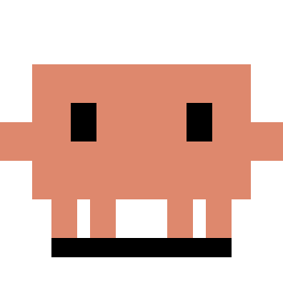
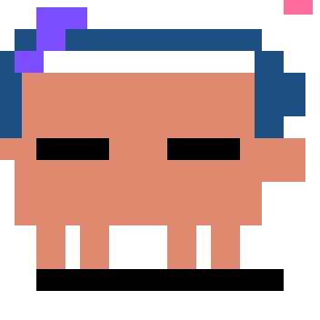
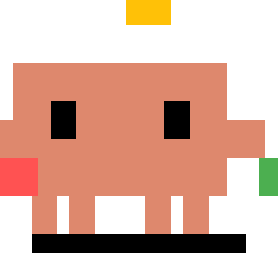
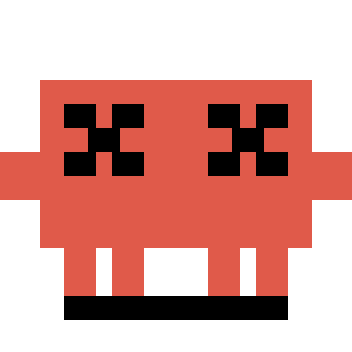
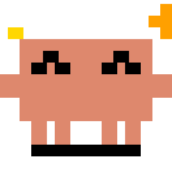
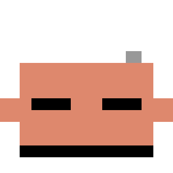

# ClaudePet

A macOS menu bar pet that shows your [Claude Code](https://docs.anthropic.com/en/docs/claude-code) working status as an animated pixel-art character.

Pure Swift/AppKit. ~3MB RAM. Near-zero CPU. No Electron. Zero dependencies.

## States

ClaudePet automatically reacts to your Claude Code sessions in real-time:

<table>
<tr>
<td align="center"><br/><b>Idle</b><br/>Breathing + blinking</td>
<td align="center"><br/><b>Thinking</b><br/>Loading dots</td>
<td align="center"><br/><b>Working</b><br/>Typing on laptop</td>
<td align="center"><br/><b>Juggling</b><br/>Subagent multitask</td>
</tr>
<tr>
<td align="center"><br/><b>Error</b><br/>Flashing red</td>
<td align="center"><br/><b>Notification</b><br/>Jumping alert</td>
<td align="center"><br/><b>Happy</b><br/>Task complete!</td>
<td align="center"><br/><b>Sleeping</b><br/>Zzz...</td>
</tr>
</table>

## How It Works

Claude Code fires [hooks](https://docs.anthropic.com/en/docs/claude-code/hooks) on session events. ClaudePet registers shell hooks that POST state changes to a local HTTP server (port 23333). The Swift app resolves the display state across multiple concurrent sessions and animates the menu bar icon.

```
Claude Code → hook event (e.g. PreToolUse) → claude-pet-hook.sh → curl POST :23333 → ClaudePet → animation
```

Each Claude Code session gets its own menu bar icon (up to 5 concurrent sessions).

## Features

- **Real-time state tracking**: Shows thinking, working, error, happy states
- **Permission bubbles**: Interactive permission requests with command preview
- **Context monitoring**: Visual context window usage indicator
- **Multi-session support**: Up to 5 concurrent Claude Code sessions

## Install

### Prerequisites

- macOS 14.0+ (Sonoma)
- Swift toolchain (`xcode-select --install` if not available)
- [Claude Code](https://docs.anthropic.com/en/docs/claude-code) CLI installed
- [jq](https://jqlang.github.io/jq/) (`brew install jq`)

### Quick Start

```bash
git clone https://github.com/0x5010/claude-pet.git ~/claude-pet
cd ~/claude-pet
swift build -c release
bash hooks/install.sh
```

`install.sh` does three things:
1. Registers 11 Claude Code hooks in `~/.claude/settings.json` (with duplicate detection)
2. Installs a LaunchAgent for auto-start on login
3. Launches ClaudePet immediately

A small pixel character should appear in your menu bar.

### Multiple Settings Files

If you use different Claude Code launch methods (e.g., `claude` and `claude-w`), you can configure multiple settings files:

```bash
# Configure both settings.json and llmbox.json
bash hooks/install.sh --extra-settings llmbox.json

# Or with short option
bash hooks/install.sh -s llmbox.json

# Multiple extra files
bash hooks/install.sh -s llmbox.json -s custom.json
```

Run `bash hooks/install.sh --help` for all options.

### Verify

Click the icon to see a menu with session info. Use the **Preview States** submenu to test each animation.

### Manual Launch

```bash
~/claude-pet/.build/release/ClaudePet &
```

## Usage

| Action | Result |
|--------|--------|
| **Click** icon | Session menu (status, model, context usage, git branch) |
| **Option+Click** | Quit ClaudePet |
| Start Claude Code | New icon appears, shows thinking/working states |
| Claude Code finishes | Happy bounce, then idle |
| 60s no activity | Zzz sleeping |

### Permission Bubbles

When Claude Code needs permission to run a tool, ClaudePet shows an interactive bubble:
- Shows tool name and command preview
- Click to expand/collapse long commands
- **Allow** or **Deny** buttons
- Dismisses when you respond (via bubble buttons or CLI)

### Context Usage

The menu displays a color-coded context window usage bar:
- Green (≤40%) → Yellow (≤65%) → Orange (≤80%) → Red (>80%)

## Uninstall

```bash
# Quick uninstall
bash hooks/uninstall.sh

# Or manual uninstall:
# 1. Stop and remove auto-start
launchctl unload ~/Library/LaunchAgents/com.claude.pet.plist 2>/dev/null
rm -f ~/Library/LaunchAgents/com.claude.pet.plist

# 2. Remove hooks from settings files (optional, uninstall.sh handles this)
# 3. Delete installed app
rm -rf ~/.claude/claude-pet
```

## Project Structure

```
claude-pet/
├── Sources/
│   ├── ClaudePet/main.swift              # Entry point, wires components
│   ├── ClaudePetCore/
│   │   └── StateManager.swift           # State machine, multi-session priority resolution
│   └── ClaudePetLib/
│       ├── HttpServer.swift             # NWListener on :23333, HTTP parser
│       ├── MultiStatusBarController.swift # Per-session NSStatusItems (max 5), animation
│       ├── NotificationBubble.swift     # Glass-morphism notification popup
│       ├── PixelRenderer.swift          # Core Graphics pixel art (45x36 grid, 8 states)
│       └── TranscriptParser.swift       # JSONL transcript parser
├── Tests/
│   └── StateManagerTests.swift          # 45+ unit tests for state machine
├── hooks/
│   ├── install.sh                       # One-command setup (hooks + LaunchAgent)
│   ├── uninstall.sh                     # Remove ClaudePet completely
│   └── claude-pet-hook.sh               # Event→state mapper, POSTs to :23333
├── assets/                              # Generated GIF previews
└── com.claude.pet.plist                  # LaunchAgent template
```

## Development

```bash
# Build (debug)
swift build

# Build + restart app
swift build && /bin/cp -f .build/debug/ClaudePet ~/.claude/claude-pet/ClaudePet
pkill -9 -f ClaudePet; sleep 1; ~/.claude/claude-pet/ClaudePet &

# Run tests
swift build --build-tests 2>&1 && \
  .build/debug/ClaudePetPackageTests.xctest/Contents/MacOS/ClaudePetPackageTests

# Regenerate GIF previews
swift run GenerateGifs assets
```

## Credits

Pixel art design inspired by [Clawd on Desk](https://github.com/rullerzhou-afk/clawd-on-desk).
